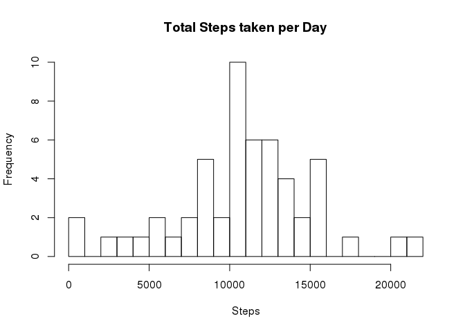
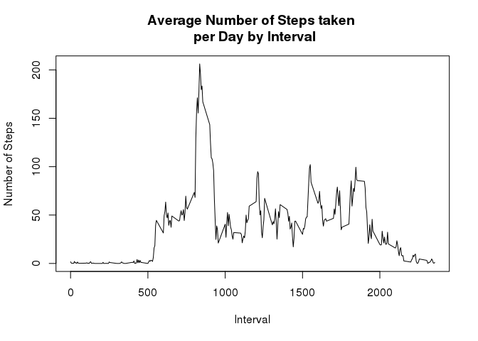
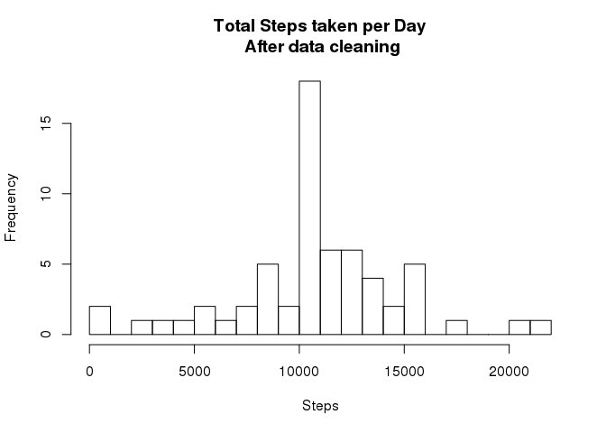
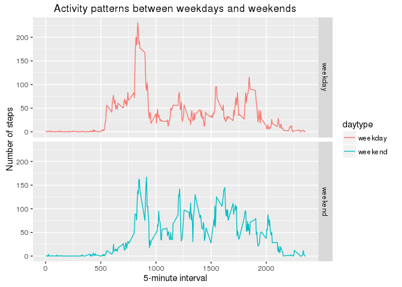

Coursera D.S Reproducible Research: Peer Assessment 1
=====================================================

Loading and preprocessing the data
----------------------------------

Download the dataset and extract to workspace if not already in workspace.

``` r
# Set the filename
filename <- "/R/workspace/RepData_PeerAssessment1/activity.zip"

# Check for existence of dataset if not present download
if (!file.exists(filename)){
  fileURL <- "https://d396qusza40orc.cloudfront.net/repdata%2Fdata%2Factivity.zip"
  download.file(fileURL, filename, method="curl")
}  

# If downloaded zip dataset not extraced, extract it
if (!file.exists("/R/workspace/RepData_PeerAssessment1/activity.csv")) { 
  unzip(filename, exdir='/R/workspace/RepData_PeerAssessment1') 
}

# Load the dataset in memory
data <- read.csv('activity.csv')
```

Mean total number of steps taken per day
----------------------------------------

Calcuate the total number of steps taken in day and generate histogram, also calulate mean and median

``` r
# Aggregated the steps mean per day
aggregatedTotalSteps <- aggregate(steps ~ date, data, sum)

# Plot the histogram
hist(aggregatedTotalSteps$steps, breaks=30, main="Total Steps taken per Day", xlab="Steps", ylab="Frequency")
```



Calculate and report the mean and median of the total number of steps taken per day

``` r
# Calculate Median
median(aggregatedTotalSteps$steps)
```

    ## [1] 10765

``` r
#Calculate Mean
mean(aggregatedTotalSteps$steps)
```

    ## [1] 10766.19

What is the average daily activity pattern?
-------------------------------------------

1.  Make a time series plot (i.e. type = "l") of the 5-minute interval (x-axis) and the average number of steps taken, averaged across all days (y-axis)

``` r
# Aggregated the steps mean by interval
aggregateStepsInterval <- aggregate(steps ~ interval, data, mean)

# Plot the time series plot
plot(aggregateStepsInterval$interval,aggregateStepsInterval$steps, type="l", xlab="Interval", ylab="Number of Steps",main="Average Number of Steps taken \n per Day by Interval")
```



1.  Which 5-minute interval, on average across all the days in the dataset, contains the maximum number of steps?

``` r
# 5-minute interval with maximum number of steps :
aggregateStepsInterval[aggregateStepsInterval$steps==max(aggregateStepsInterval$steps),1]
```

    ## [1] 835

Imputing missing values
-----------------------

Calculate and report the total number of missing values in the dataset (i.e. the total number of rows with NAs)

``` r
# Count the total number of missing values in dataset
sum(is.na(data$steps))
```

    ## [1] 2304

Fill the missing values with the by taking mean for that 5-minute interval, and mean for 5-minute interval are ceiled and Create a new dataset that is equal to the original dataset but with the missing data filled in.

``` r
# Clean the dataset by replacing the NA's by 5-minute interval mean
#data$interval <- as.factor(data$interval)
cleanData <- data
tempIntervalmean <- aggregate(steps ~ interval, data, mean)
tempIntervalmean$steps <- ceiling(tempIntervalmean$steps)

for(i in 1:nrow(data)){
    if(is.na(data[i,1]))
        cleanData[i,1] <- tempIntervalmean$steps[tempIntervalmean$interval == data[i,3]]
}
```

Make a histogram of the total number of steps taken each day after Imputing missing values

``` r
# Aggregated the steps mean per day for cleaned data
aggregatedTotalSteps <- aggregate(steps ~ date, cleanData, sum)
hist(aggregatedTotalSteps$steps, breaks=30, main="Total Steps taken per Day\n After data cleaning", xlab="Steps", ylab="Frequency")
```



Calculate Mean and median for cleaned data

``` r
# Calculate Median for cleaned data
median(aggregatedTotalSteps$steps)
```

    ## [1] 10909

``` r
#Calculate Mean for cleaned data
mean(aggregatedTotalSteps$steps)
```

    ## [1] 10784.92

Are there differences in activity patterns between weekdays and weekends?
-------------------------------------------------------------------------

``` r
# Load library 
library(ggplot2)

# add new column in the datasest
cleanData$daytype <- 0

# assign value weekend for "Saturday" and "Sundaay" and weekday for rest
cleanData$date <- as.Date(cleanData$date)
for(i in 1:nrow(cleanData)){
    if(weekdays(cleanData[i,2]) %in% c('Sunday', 'Saturday'))
        cleanData[i,4] <- "weekend"
    else
        cleanData[i,4] <- "weekday"
}

#data$daytype <- as.factor(data$daytype)
#data$interval <- as.numeric(data$interval)

# Aggregated the steps mean by interval and daytype i.e weekend or weekdays
aggDataWeektype <- aggregate(steps ~ interval + daytype, data=cleanData, mean)

# Plot the data
ggplot(aggDataWeektype, aes(interval, steps)) + geom_line( aes(color = daytype, group=daytype)) + facet_grid(daytype ~ .) + xlab("5-minute interval") + ylab("Number of steps") + ggtitle("Activity patterns between weekdays and weekends")
```


